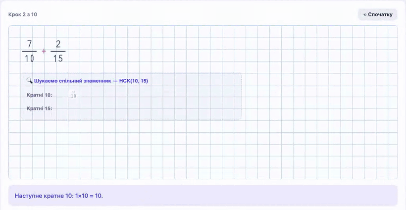

# StepBy School

Освітній портал українською: шкільні предмети й гуртки **крок за кроком**. Для учня — інтерактивні інструменти, що показують розв'язання так, ніби його пишуть від руки на зошиті в клітинку. Для вчителя — КТП, конспекти уроків і схеми на проєктор.

**▶ Відкрити портал: [vmyronovych.github.io/stepby-school](https://vmyronovych.github.io/stepby-school/)**

## Що всередині

Зараз на порталі такі предмети й гуртки (інші в розробці):

- **Математика 5–6 і 10 класів** — множення й ділення в стовпчик, дільники і кратні, розкладання на прості множники, НСК, дії з дробами, рівняння, пропорції, область визначення функції. Кожен інструмент приймає власну умову.
- **Інформатика 3–4 класів (НУШ)** — КТП на 2026/2027, конспекти уроків для вчителя, файл для НІТ і схеми на проєктор: клавіатура та навчальна копія Windows 10/11.
- **Гурток робототехніки (3–4 кл.)** — поурочні плани і конструктор електричного кола зі схемою та макеткою.

## Запуск

Збирати нічого не треба: відкрийте `index.html` у браузері (працює й через `file://`). Жодних залежностей, бекенду чи мережевих запитів.

Архітектура, правила анімації й перевірка змін — у [CLAUDE.md](CLAUDE.md).
